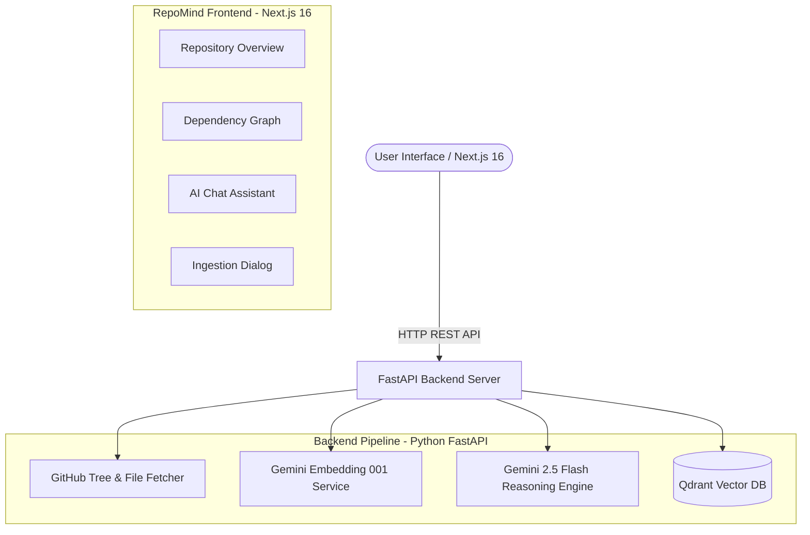

# RepoMind 🧠⚡
> **AI-Powered Codebase Intelligence & RAG Exploration Platform**

RepoMind is a modern, high-performance web application and Retrieval-Augmented Generation (RAG) system that indexes GitHub repositories into a high-dimensional vector database and enables real-time AI-powered code analysis, interactive Q&A, dependency visualization, and documentation exploration.

---

## 🌟 Key Features

- 🚀 **Asynchronous GitHub Repository Ingestion**: Traverses repository file trees, parses source code across Python, TypeScript, JavaScript, Go, Markdown, and more, and processes code chunks in real-time.
- 🔍 **Vector Search RAG Pipeline**: Powered by **Qdrant Vector Database** and **Google Gemini Embedding 001** (3072-dimensional vector embeddings) with fast cosine similarity retrieval.
- 💬 **Context-Grounded AI Assistant**: Grounded code Q&A powered by **Google Gemini 2.5 Flash**, featuring markdown rendering, code block syntax highlighting, and exact source file citations.
- 📊 **Interactive Dependency Graph**: Dynamic SVG layout visualizing file directory hierarchies, inter-file relationships, and module weights.
- 📁 **Repository & File Explorer**: Instant browsing of indexed file listings, lines of code (LOC), top-level directory scopes, and vector storage stats.
- 🎨 **State-of-the-Art Editorial UI**: Premium dark/light mode interface built with Next.js 16, React 19, Tailwind CSS, Lucide icons, and subtle paper grain textures.

---

## 🏗️ Architecture Overview



---

## 📂 Project Structure

```text
Repomind/
├── repomind-backend/                # FastAPI RAG Backend
│   ├── app/
│   │   ├── main.py          # FastAPI route handlers & task tracker
│   │   ├── config.py        # Typed settings & environment loader
│   │   ├── database/
│   │   │   └── vector_db.py # Qdrant vector database interface
│   │   ├── schemas/         # Pydantic models & request schemas
│   │   └── services/
│   │       ├── gemini.py    # Google GenAI SDK (Embeddings & LLM)
│   │       └── github.py    # GitHub API repository fetcher
│   ├── tests/               # Integration unit test suite
│   └── requirements.txt
│
└── repomind-frontend/               # Next.js 16 Web Application
    ├── app/                         # App router (Landing & Workspace)
    ├── components/
    │   ├── workspace/              # AiAssistant, RepositoryOverview, Graph
    │   ├── layout/                 # Topbar, Sidebar, WorkspaceLayout
    │   └── ui/                     # Reusable UI components
    ├── lib/                         # API client, Custom Hooks, Global Store
    └── types/                        # TypeScript ambient module declarations
```

---

## ⚙️ Prerequisites & Environment Setup

### 1. Backend Configuration

Create a `.env` file inside `repomind-backend/.env`:

```env
# === API Keys ===
GEMINI_API_KEY=your_gemini_api_key_here
GITHUB_TOKEN=your_github_token_here (optional, increases API rate limits)

# === Vector DB ===
QDRANT_URL=./qdrant_db
QDRANT_COLLECTION=git_rag

# === App Settings ===
EMBEDDING_MODEL=models/gemini-embedding-001
LLM_MODEL=models/gemini-2.5-flash
CHUNK_SIZE=1000
CHUNK_OVERLAP=200

# === CORS ===
CORS_ORIGINS=http://localhost:3000
```

### 2. Install Dependencies

#### Backend (Python 3.10+)
```bash
cd repomind-backend
pip install -r requirements.txt
```

#### Frontend (Node.js 18+)
```bash
cd repomind-frontend
npm install
```

---

## 🚀 Running the Project

### Start Backend FastAPI Server
```bash
cd repomind-backend
python -m uvicorn app.main:app --host 127.0.0.1 --port 8000 --reload
```
- **Live API Health**: `http://127.0.0.1:8000/health`
- **Interactive Swagger Docs**: `http://127.0.0.1:8000/docs`

### Start Frontend Next.js Dev Server
```bash
cd repomind-frontend
npm run dev
```
- **Web App Interface**: `http://localhost:3000`

---

## 🧪 Running Tests

Execute the automated backend test suite:
```bash
cd repomind-backend
python -m unittest discover tests
```

---

## 📡 API Endpoint Reference

| Method | Endpoint | Description |
| :--- | :--- | :--- |
| `GET` | `/health` | Check backend server health status |
| `POST` | `/api/ingest` | Kick off asynchronous repository ingestion task |
| `GET` | `/api/ingest/status/{taskId}` | Poll status of background ingestion task |
| `POST` | `/api/query` | Send natural-language query to RAG pipeline |
| `GET` | `/api/repos` | List all ingested repositories |
| `GET` | `/api/repos/files` | List indexed files for a repository |
| `GET` | `/api/collections/info` | Fetch vector database statistics |
| `DELETE` | `/api/collections` | Purge vector collection cache |

---

## 👥 Contributors

Special thanks to the contributors of RepoMind:

- [@kessie07](https://github.com/kessie07) — Project Contributor

---

## 📄 License
This project is licensed under the MIT License.
